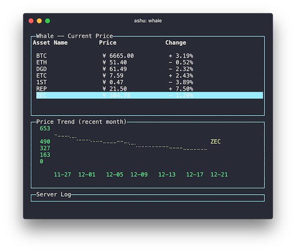
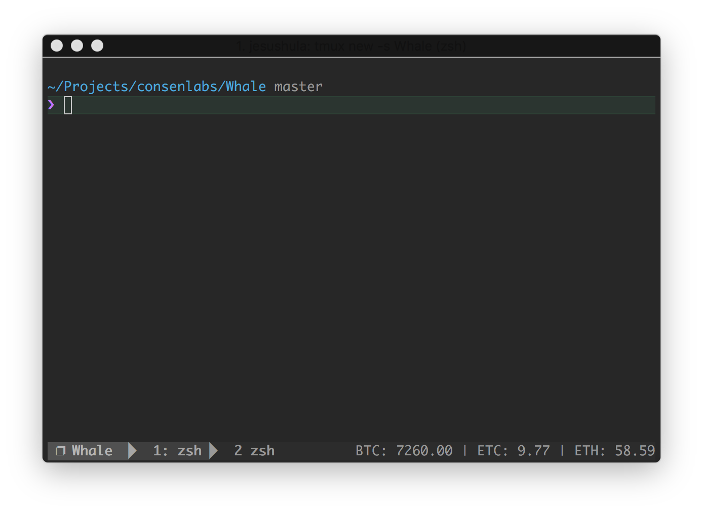

# Whale

> Show Ethereum and Bitcoin price in command line interface (CLI).



## Install
```
$ npm install whale-cli -g
```

## Usage
```
$ whale --help

Usage: whale [options]

Whale, show Ethereum and Bitcoin price in command line interface (CLI).

Options:

  -h, --help              output usage information
  -V, --version           output the version number
  -s, --seconds <number>  Set auto refresh time

Examples:

  $ whale
  $ whale -h
  $ whale -s 60
```

## Interactive UI
Run `whale` without arguments to launch the interactive UI that guides you through showing market price.


## API
```javascript
const whale = require('whale-cli')

/**
 * Fetch current price of markets
 * @param {String} exchange
 * @param {Array} markets
 */
whale.getCurrentPrice('Poloniex', ['BTC', 'ETH', 'ZEC']).then((res) => {
  console.log(res)
})

/**
 * Fetch current price of markets
 * @param {String} exchange
 * @param {String} market
 * @param {Number} since options, default one month ago
 * @param {Number} period options, default 24 hour, such as 1440
 */
whale.getPriceTrend('Yunbi', 'ETH').then((res) => {
  console.log(res)
})
```

## Supported Exchanges
- [Poloniex](https://poloniex.com)
- [Kraken](https://kraken.com)
- [Yunbi](https://yunbi.com)
- [Coinbase](https://coinbase.com/)
- [Bitfinex](https://bitfinex.com/)

## Tmux StatusBar
if you use tmux, a mini statusbar plugin is available

### Installation
Add this line to the bottom of .tmux.conf:
``` shell
run-shell 'whale-tmux-sh "-m Yunbi -t BTC,ETC,ETH"'
```

Reload TMUX environment:

``` shell
# type this in terminal
$ tmux source-file ~/.tmux.conf
```

 #{whale-tmux} interpolation should now work.

Config helper
``` shell
# type this in terminal
$ whale-tmux -h
```
### Limitations
Set status-interval to a low number to make this faster, example:
``` shell
# in .tmux.conf
set -g status-interval 5
```




## License

MIT © [树](https://github.com/Aaaaaashu/Whale/blob/master/LICENSE)
