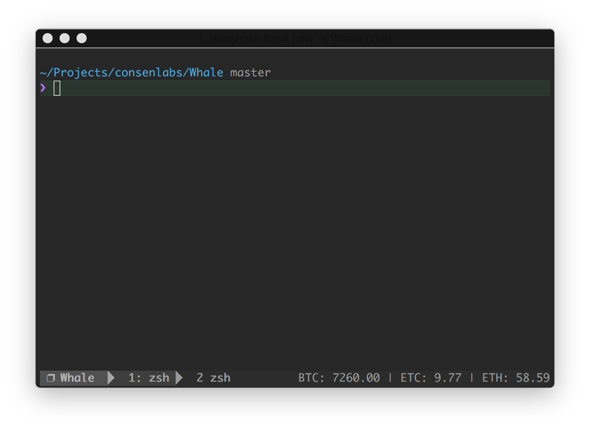

Contributor: [hulajesus](https://github.com/hulajesus)

## Install
```
$ npm install whale-cli -g
```

### Config
Add this line to the bottom of .tmux.conf:
``` shell
run-shell 'whale-tmux-sh "-m Yunbi -t BTC,ETH,ETC"'
```

Reload TMUX environment:
``` shell
# type this in terminal
$ tmux source-file ~/.tmux.conf
```

 #{whale-tmux} interpolation should now work.

Config helper
``` shell
# type this in terminal
$ whale-tmux -h
```

### Limitations
Set status-interval to a low number to make this faster, example:
``` shell
# in .tmux.conf
set -g status-interval 5
```


